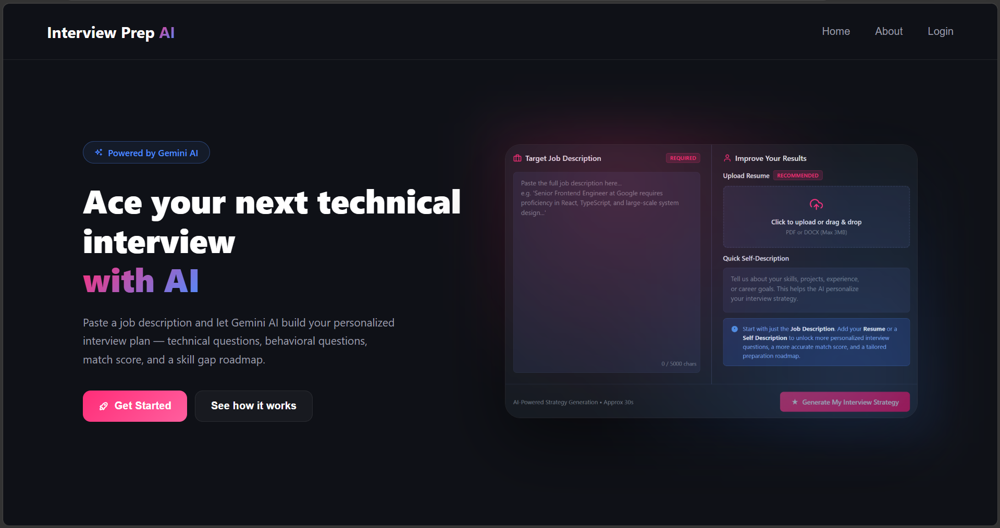
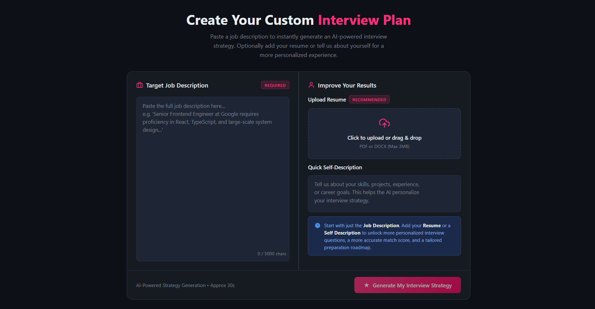
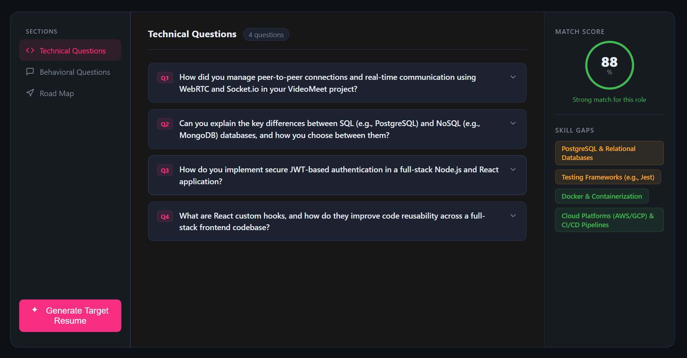

# Interview Prep AI

AI-powered full-stack interview preparation platform that analyzes job descriptions and candidate information to generate personalized interview reports, identify skill gaps, prepare role-specific interview questions, and create job-targeted resumes.



## 🛠️ Built With


## ✨ Key Features

- 🎯 **Personalized Interview Preparation** — Analyzes the job description and candidate information to generate a match score, skill-gap analysis, technical and behavioral questions with suggested answers, and a preparation roadmap.
- 📝 **Target Resume Generator** — Creates a job-targeted resume and downloads it as a PDF.
- 🔐 **Authentication & History** — Supports email/Google authentication and lets users access or delete previous interview reports.

## 🖥️ Application Preview

### Interview Setup

Users provide the target job description and can optionally add a resume or self-description for more personalized results.



### Personalized Interview Report

The generated report includes role-specific interview preparation, skill-gap analysis, interview Q&A, and a preparation roadmap.



## ⚙️ How It Works

### 🎯 Personalized Interview Analysis
The user starts by providing a **Job Description**, which is the only required input. They can optionally upload a **PDF/DOCX resume** and add a **self-description** for more personalized results.

The backend extracts the resume content and combines the available candidate information with the job description. This data is sent to **Gemini AI**, which returns a structured interview report containing a **match score, skill gaps, technical and behavioral questions with suggested answers, and a preparation roadmap**.

### 📝 Job-Targeted Resume Generation
From the generated interview report, users can create a resume specifically targeted to the job description. Gemini generates structured resume content using the available candidate information and job requirements.

The backend converts the generated content into a formatted document using **Puppeteer** and returns it as a downloadable **PDF resume**.

### 🔐 Authentication & Report History
Users can create an account using **email/password or Google sign-in**. Email/password credentials are secured with bcrypt, while authenticated sessions are managed using **JWTs stored in HTTP-only cookies**.

Generated interview reports are associated with the authenticated user and stored in **MongoDB**, allowing users to revisit or delete their previous reports from the History section.

### 🔄 Reliable AI Integration
Gemini responses are generated in a structured format so the frontend can reliably display different parts of the interview report.

The backend also handles temporary AI-service failures with **retry logic and a secondary Gemini model fallback**. If the service remains unavailable, the application returns a user-friendly error instead of failing silently.
## 📁 Project Structure

```text
interview-prep-ai/
├── Backend/
│   ├── src/
│   │   ├── config/          # Application configuration
│   │   ├── controllers/     # Request handling and business logic
│   │   ├── middlewares/     # Authentication, uploads, error handling
│   │   ├── models/          # MongoDB/Mongoose models
│   │   ├── routes/          # REST API routes
│   │   └── services/        # AI and application services
│   ├── server.js
│   └── package.json
│
├── Frontend/
│   ├── src/
│   │   ├── assets/
│   │   ├── components/      # Shared UI components
│   │   ├── features/
│   │   │   ├── auth/        # Authentication feature
│   │   │   └── interview/   # Interview preparation feature
│   │   ├── layouts/
│   │   ├── pages/
│   │   ├── App.jsx
│   │   └── app.routes.jsx
│   └── package.json
│
├── screenshots/             # README project screenshots
└── README.md
```

## 📦 Installation & Setup

### 1. Clone the repository

```bash
git clone https://github.com/manajitsaha18/interview-prep-ai.git
cd interview-prep-ai
```

### 2. Install Backend Dependencies

```bash
cd Backend
npm install
```

### 3. Install Frontend Dependencies

```bash
cd ../Frontend
npm install
```

### 4. Configure Environment Variables

Create a `.env` file inside the `Backend` directory:

```env
MONGO_URI=your_mongodb_connection_string
JWT_SECRET=your_jwt_secret
GOOGLE_GENAI_API_KEY=your_gemini_api_key

FRONTEND_URL=http://localhost:5173
NODE_ENV=development

FIREBASE_PROJECT_ID=your_firebase_project_id
FIREBASE_CLIENT_EMAIL=your_firebase_client_email
FIREBASE_PRIVATE_KEY=your_firebase_private_key
```

Create a `.env` file inside the `Frontend` directory:

```env
VITE_API_URL=http://localhost:3000
```

> Replace the placeholder values with your own credentials. Never commit `.env` files or private keys to version control.

### 5. Start the Backend

Open a terminal from the project root:

```bash
cd Backend
npm run dev
```

### 6. Start the Frontend

Open another terminal:

```bash
cd Frontend
npm run dev
```

The Vite development server will display the local frontend URL in the terminal.

## 🚀 Deployment

The application is deployed using:

- **Frontend:** Vercel
- **Backend:** Render
- **Database:** MongoDB Atlas
- **AI:** Google Gemini API

Production environment variables are configured separately on the respective deployment platforms.
